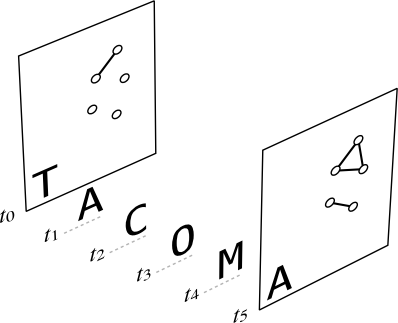

# TACOMA

TemporAl COntact Modeling and Analysis. Provides fast tools to analyze temporal contact networks, produce surrogate networks using qualitative models and simulate Gillespie processes on them.

## Install

If you get compiling errors, make sure that [https://github.com/pybind/pybind11](pybind11) is installed.

    $ git clone https://github.com/benmaier/tacoma
    $ pip install pybind11
    $ pip install ./tacoma

## Some Explanations

### Data formats

There's two data formats in which temporal networks can be passed to the functions of this package.

The first one is simply a list of undirected edge lists, i.e. we have
an `n_t` long list of time points `t_i` for which we also have edge lists `e_i` with `0 <= i <= n_t-1`. This is considered to be 
a list of states, i.e. at each time `t_i` the network is fully described by an edge list `e_i` and node number `N`. We also assume that the
network is in state `(e_i, N)` for a time of `dt = t_{i+1} - t_i` until its state changes again at time `t_{i+1}`.

```python
class edge_lists():

    def __init__(self):
        
        # those times describe the time point when we stopped measuring
        self.tmax

        # this is the number of nodes
        self.N

        # this list contains the times when the network changes to now contain
        # different edges
        # it has to be a list of floats
        self.t

        # this list contains the edges the network has between times t_i and t_{i+1}
        # it has to be a list of lists of tuples containing two unsigned integers
        self.edges
```

The second one is a list of undirected edge lists with an initial state `(e_{inital}, N)` and initial time `t_{initial}`. Compared to the first
format, this list is `n_t-1` long and contains lists for edges going out `e^{out}_i` and edges coming in `e^{in}_i` with `0 <= i <= n_t-2`.
We consider the events of edges being deleted and edges being formed to take place at exactly `t_i`, i.e. the network changes at `t_i` and
will remain in the same state until `t_{i+1}` when the next change takes place.

```python
class edge_changes():

    def __init__(self):
        
        # those times describe the time points when we started
        # measuring and when we stopped measuring, respectively
        self.t0
        self.tmax

        # this is the number of nodes
        self.N 

        # this list contains the edges of the initial Graph
        # it has to be a list of tuples containing two unsigned integers
        self.edges_initial 

        # this list contains the event times
        # it has to be a list of floats
        self.t

        # this list contains the edges being deleted at the corresponding times
        # it has to be a list of lists of tuples containing two unsigned integers
        self.edges_in

        # this list contains the edges being formed at the corresponding times
        # it has to be a list of lists of tuples containing two unsigned integers
        self.edges_out
```
### Working with models

Even though this package started as a collection of simulation functions for the Flockwork model, 
it grew to incorporate other models of temporal networks, as well. Specifically, I implemented a version of
the dynamic random geometric graph model (dynamic RGGs), as well as the model by Zhao, Stehle, Bianconi, and Barrat (ZSBB model).
In the following I explain the work flow for generating models and measuring observables.

Both the Flockwork models as well as the ZSBB model are based on node-centric events, i.e. nodes leaving
groups or nodes joining groups. Hence, for an event time `t`, it does not make much sense to save a whole edge list.
Rather, we will save a list of edges being deleted at time `t` as well as a list of edges being created at time `t`.
Naturally, those models need an initial state which has to be passed to the function. 

### Measuring group sizes and durations

There's two data formats which we can pass to the measurement function, as described above. The first one is the `edge_lists` for, e.g.
real-world data or the dynamic RGG model. The second one is `edge_changes` for, e.g. the Flockwork models or the ZSBB model.

## Examples

### Python

    $ python sandbox/meanfieldtest.py
