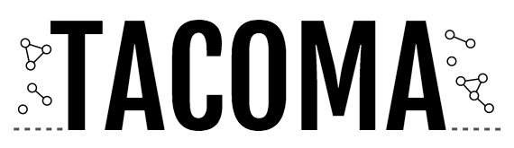

TemporAl COntact Modeling and Analysis. Provides fast tools to analyze temporal contact networks, 
produce surrogate networks using qualitative models and simulate Gillespie processes on them.

## Quick example

In order to download the SocioPatterns 
['Hypertext 2009'-dataset](http://www.sociopatterns.org/datasets/hypertext-2009-dynamic-contact-network/) 
and visualize it interactively, do the following.

```python
>>> import tacoma as tc
>>> from tacoma.interactive import visualize
>>> temporal_network = tc.download_and_convert_sociopatterns_hypertext_2009()
100% [..............................................................................] 67463 / 67463
>>> visualize(temporal_network, frame_dt = 20)
```


## What is tacoma?

`tacoma` is a joint C++/Python-package for the modeling and analysis of undirected and 
unweighted temporal networks, with a focus on (but not limited to) human face-to-face contact networks.

### Pros of using tacoma

* networks are natively described in continuous time (which includes descriptions in discrete time
* two main native formats to describe temporal networks (`tc.edge_lists` and `tc.edge_changes`),
  a third way, a sorted list of `on`-intervals for each edge called `tc.edge_trajectories` is
  available, but algorithms work on the two native formats only
* the simple portable file-format `.taco` as a standardized way to share temporal network data
  (which is just the data dumped to a `.json`-file, a simple file format readable from a
  variety of languages)
* easy functions to produce surrogate temporal networks from four different models
* easy way to simulate Gillespie (here, epidemic spreading) processes on temporal networks
  with an implementation of [Vestergaard's and Génois's adapted algortihm](https://journals.plos.org/ploscompbiol/article?id=10.1371/journal.pcbi.1004579)
* easy framework to develop new Gillespie-simulations algorithms on temporal networks
* multiple and simple ways to interactively visualize temporal networks
* simple functions to manipulate temporal networks (slice, concatenate, rescale time, sample, bin, convert)
* simple functions to analyze structural and statistical properties of temporal networks
  (mean degree, degree distribution, group size distribution, group life time distributions, etc.)
* fast algorithms due to C++-core (_fast_ as in _faster than pure Python_)
* relatively fast and easy to compile since it only depends on the C++11-stdlib 
  and [pybind11](https://github.com/pybind/pybind11) without the large overhead of `Boost`

### Cons of using tacoma

* no support for directed temporal networks yet
* no support for weighted temporal networks yet

## Install

If you get compiling errors, make sure that [pybind11](https://github.com/pybind/pybind11) is installed.

    $ git clone https://github.com/benmaier/tacoma
    $ pip install ./tacoma

Note that a C++11-compiler has to be installed on the system before installing `tacoma`. On OS X
it might happen that even though pip installed `pybind11` it's not available during installation.
If that happens please open a detailed issue here. You might want to try 
    
    $ brew install pybind11

as a work-around.

### Packages not automatically installed during installation

The following packages are not installed during installation with `pip` since they're only required
for drawing and drawing is not essential. If you want to use `tacoma.drawing`, please install

    matplotlib
    networkx
    python-louvain (community)

## Documentation

The documentation is currently available at http://rocs.hu-berlin.de/~tacoma. It is full of
typos and non-exhaustive but I think the important points are in there.


## Examples

Check out the [sandbox directory](https://github.com/benmaier/tacoma/tree/master/sandbox]).

Here is an example for the temporal network format `tc.edge_changes`.

```python
import tacoma as tc
from tacoma.interactive import visualize

# define temporal network as a list of edge changes
temporal_network = tc.edge_changes()
temporal_network.N = 10
temporal_network.edges_initial = [ (0,1), (2,3), (1,7), (3,5), (1,9), (7,2) ]
temporal_network.t0 = 0.0
temporal_network.t = [ 0.8, 2.4 ]
temporal_network.tmax = 3.1
temporal_network.edges_in = [ 
                              [ (0, 5), (3, 6) ], 
                              [ (3, 7), (4, 9), (7, 8) ],
                            ]
temporal_network.edges_out = [ 
                                [ (0, 1) ],
                                [ (2, 3), (3, 6) ],
                             ]

visualize(temporal_network, frame_dt = 0.05)
```


## License

The whole software is published under the MIT software license. The documentation and all figures are copyrighted by Benjamin F. Maier. Ask for permission if you want to distribute parts.
