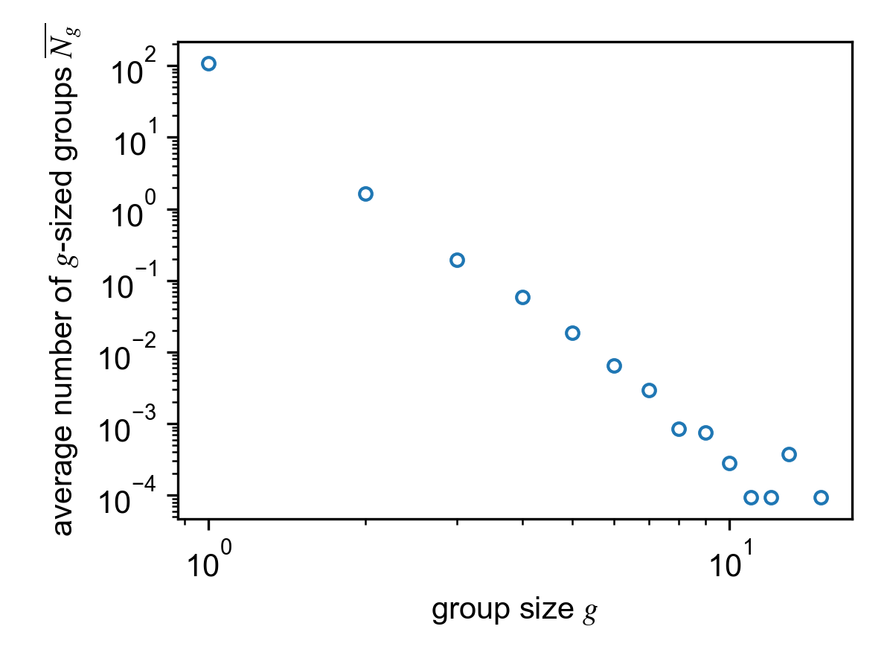
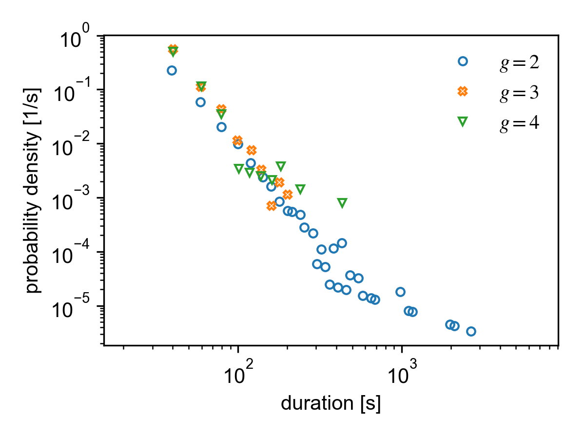
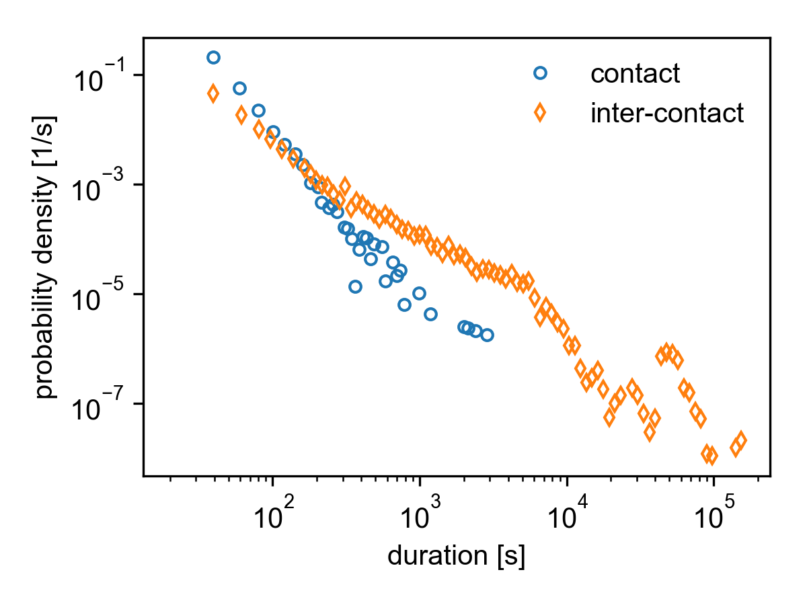

Group sizes, durations and aggreation
=====================================

The analysis of real-world face-to-face data is often
based on the analysis of networks in terms of disconnected
groups --- the group sizes, their lifetimes and the contact
durations distributions. 
Furthermore, an aggregated static network is often used
to analyze the social structure.
In the following we show 
how to compute and analyze these observables easily.

Base analysis function
----------------------

To do a complete measurement of the group size histograms,
the group life time distributions, the contact and
inter-contact distributions, and the aggregated weighted
network use :func:`tacoma.api.measure_group_sizes_and_durations`

.. code:: python
    
    result = tc.measure_group_sizes_and_durations(temporal_network)

The returned object is an instance of :class:`_tacoma.group_sizes_and_durations`.

Group sizes
-----------

We define the group size distribution :math:`N_g(t)` describing
the number of groups of size :math:`g` at time :math:`t`.
Note that the group size distribution is restricted by

.. math::

    \sum_{g=1}^N gN_g(t) = N = \mathrm{const.}

The
time-dependent group size distribution is saved in two ways.

For `edge_lists`
~~~~~~~~~~~~~~~~
For each edge list, a size
histogram as a dictionary of (int, int)-pairs is saved in the
attribute ``result.size_histograms``. The key is the group size
:math:`g` and the value is number of its occurences.

For `edge_changes`
~~~~~~~~~~~~~~~~~~
A single group size histogram is computed for the initial edge list.
Then, for each edge changing event,
a dictionary is saved in ``result.size_histogram_differences``, where
keys are the group size :math:`g` and the corresponding value is
the change of occurences in comparison to the network's previous state.

.. note::

    Since evaluating the size histograms might be heavy on memory, you
    can omit the detailed computation using

    .. code:: python

        result = tc.measure_group_sizes_and_durations(
                            temporal_network,
                            ignore_size_histogram=True
                            )
      
Averaged size distribution
~~~~~~~~~~~~~~~~~~~~~~~~~~

The average group size distribution

.. math::

    \overline{N_g} = \frac{1}{t_\mathrm{max}-t_0}
                     \int\limits_{t_0}^{t_\mathrm{max}}dt\, N_g(t)

is saved in ``result.aggregated_size_histogram``, a list of floats
where the `g`-th entry contains the average number of groups of size
`g`. Note that this implies that the 0-th entry is always equal to 0.

You can easily get a ``numpy.ndarray`` of group sizes `g` and corresponding
average number of groups of this size ``N_g`` using the function 
:func:`tacoma.tools.group_size_histogram`.

.. code::
    
    g, N_g = tc.group_size_histogram(result)

Note that this function returns
values for non-zero occurences only.

If you are just interested in the mean group size, use
:func:`tacoma.tools.mean_group_size`

.. code::
    
    mean_g = tc.mean_group_size(result)

Number of groups
~~~~~~~~~~~~~~~~

At all times, the number of seperated components (groups) is given by

.. math::

    c(t) = \sum_{g=1}^N N_g(t)

and thus the mean number of components over time is

.. math::

    \overline{c} = \sum_{g=1}^N \overline{N_g}.

It can be computed with :func:`tacoma.tools.mean_number_of_groups`.

.. code:: python

    mean_c = tc.mean_number_of_groups(result)

Coordination number
~~~~~~~~~~~~~~~~~~~

The coordination number :math:`n` of a single node is defined as the
group size this node is part of, as was first done in a study by
`Zhao, Stehlé, Bianconi, and Barrat`_.
The probability distribution of the coordination
number is given by the group size distribution :math:`N_g` as

.. math::

    P_n(t) = \frac{nN_n}{N}.

It can also be interpreted as the probability of a single node
to be in a group of size :math:`n`.

The mean coordination number :math:`\left\langle n \right\rangle` can be
computed as

.. code:: python

    mean_n = tc.mean_coordination_number(result)

Analysis
~~~~~~~~

Plot a distribution of group sizes as

.. code:: python

    from tacoma.analysis import plot_group_size_histogram
    import matplotlib.pyplot as pl

    ht09 = tc.load_sociopatterns_hypertext_2009()
    result = tc.measure_group_sizes_and_durations(ht09)

    fig, ax = pl.subplots(1,1)
    plot_group_size_histogram(result, ax)
    pl.show()

    Average group size histogram for the SocioPatterns Hypertext 09 dataset.

Durations
---------

Group durations
~~~~~~~~~~~~~~~

A group is initiated as soon as an event leads to a change in members.
The duration of this group is defined as the time it takes until the 
next event at which the constituents of the group changes.

All durations of groups of size :math:`g` are saved in 
``result.group_durations[g]`` (hence, ``result.group_durations[0]``
is always empty).

Groups which were active at :math:`t_0` are not considered in the
measurement since
we do not know when they were initiated, so including them in the analysis would
skew the distribution. Likewise, groups which are still active at 
:math:`t_\mathrm{max}` are omitted for the same reason.

The durations can be analyzed using :func:`tacoma.analysis.plot_group_durations`.

.. code:: python

    from tacoma.analysis import plot_group_durations
    import matplotlib.pyplot as pl

    ht09 = tc.load_sociopatterns_hypertext_2009()
    result = tc.measure_group_sizes_and_durations(ht09)

    fig, ax = pl.subplots(1, 1)
    plot_group_durations(result, ax, max_group=4, time_unit='s')

    pl.show()

    Duration distribution of different group sizes for the SocioPatterns Hypertext 09 dataset.

(Inter-) Contact durations
~~~~~~~~~~~~~~~~~~~~~~~~~~

The durations of all contacts is saved in ``result.contact_durations``.
However, contacts which were active at :math:`t_0` are omitted since
we do not know when they started, so including them in the analysis would
skew the distribution. Likewise, contacts which are still active at 
:math:`t_\mathrm{max}` are omitted for the same reason.

The inter-contact duration of a node is defined as the time a node spends
alone (i.e. in a group of size :math:`g=1`). Hence, all inter-contact 
durations are saved in ``result.group_durations[1]``.

The contact and inter-contact durations can be analyzed using 
:func:`tacoma.analysis.plot_group_durations`.

.. code:: python

    from tacoma.analysis import plot_contact_durations
    import matplotlib.pyplot as pl

    ht09 = tc.load_sociopatterns_hypertext_2009()
    result = tc.measure_group_sizes_and_durations(ht09)

    fig, ax = pl.subplots(1, 1, figsize=(4,3))
    plot_contact_durations(result, ax, time_unit='s')
    pl.show()

    Contact and inter-contact distributions
    for the SocioPatterns Hypertext 09 dataset.

Aggregated network
------------------

The aggregated network

.. math::
    
    W_{ij} = \int\limits_{t_0}^{t_\mathrm{max}}dt\,A_{ij}(t)

is given as a dictionary in ``result.aggregated_network``. Each key
is a pair of ints, representing the edge :math:`(i, j)`, the
corresponding value is :math:`W_{ij}`.

If you just want the aggregated network without the other results,
use :func:`tacoma.api.aggregated_network`.

.. _Zhao, Stehlé, Bianconi, and Barrat: https://arxiv.org/abs/1102.2423

