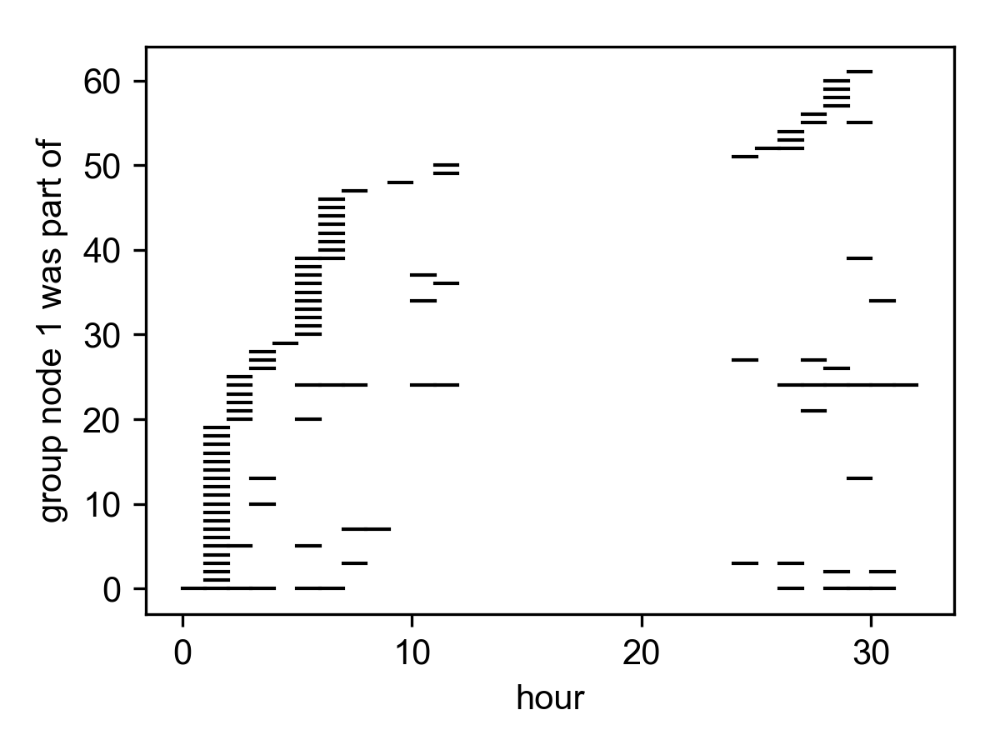
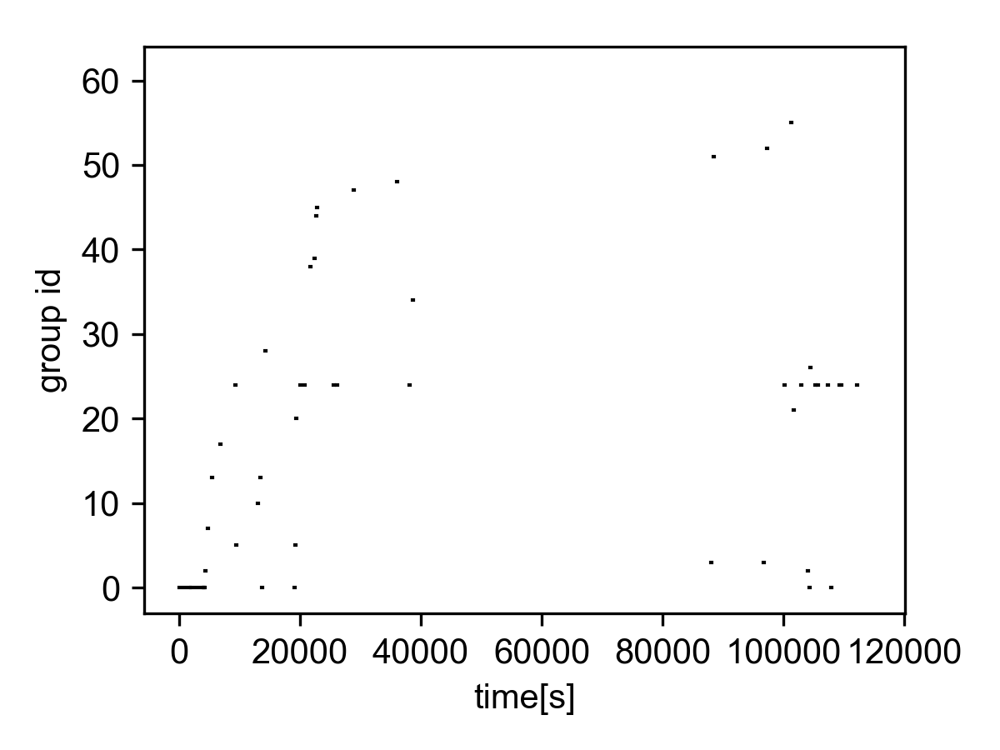

Social trajectories
===================

Binned
~~~~~~

The term `social trajectory` was coined by 
`Sekara, Stopczynski, and Lehmann`_ and 
refers to the groups an individual node was 
part of over time.

In their study they used a binned social trajectory,
showing the groups each node was part of each day.

To reproduce this, use the function 
:func:`tacoma.api.binned_social_trajectory`

It returns a set of group indices the single node was 
part of in each time interval.

Here's an example binned for each hour.

.. code:: python

    from tacoma.analysis import plot_social_trajectory
    import matplotlib.pyplot as pl

    ht09 = tc.load_sociopatterns_hypertext_2009()
    binned_traj = tc.binned_social_trajectory(ht09, node=1,
                                              N_time_steps=int(ht09.tmax/3600.))

    fig, ax = pl.subplots(1, 1, figsize=(4,3))
    for it, groups in enumerate(binned_traj):
        for g in groups:
            ax.plot([it,it+1], [g,g], 'k')
    ax.set_xlabel('hour')
    ax.set_ylabel('group node 1 was part of')
    pl.show()    

    Binned social trajectory for node 1, showing the groups of 
    size :math:`g>1` it was part of each hour (Sociopatterns
    Hypertext 09 dataset

Alternatively, use the function
:func:`tacoma.analysis.plot_binned_social_trajectory`.
    
Continuous time
~~~~~~~~~~~~~~~

A more sensible function respecting continuous time
is the pure social trajectory
returned by :func:`tacoma.api.social_trajectory`.

It can be easily computed and plotted using 
:func:`tacoma.analysis.plot_social_trajectory`.

.. code:: python

    from tacoma.analysis import plot_social_trajectory
    import matplotlib.pyplot as pl

    ht09 = tc.load_sociopatterns_hypertext_2009()
    soc_traj = tc.social_trajectory(ht09, node=1)

    fig, ax = pl.subplots(1, 1, figsize=(4,3))
    plot_social_trajectory(soc_traj, ax, time_unit='s')
    pl.show()

    Social trajectory for node 1, showing the groups of 
    size :math:`g>1` it was part of (Sociopatterns
    Hypertext 09 dataset

.. _`Sekara, Stopczynski, and Lehmann`: http://www.pnas.org/content/113/36/9977
