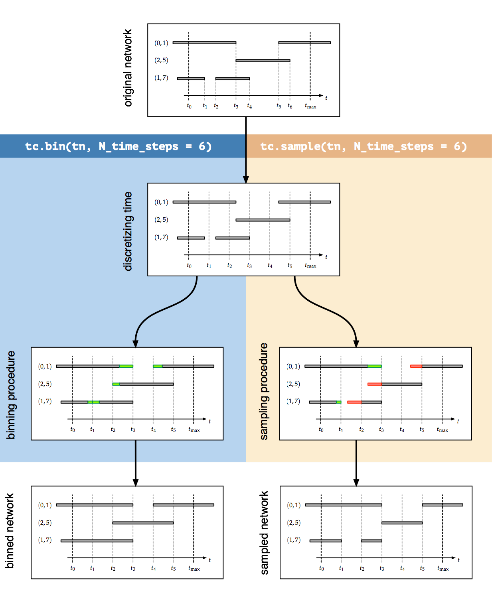

Binning and sampling
--------------------

Temporal networks are, naturally, objects recorded in a world of continuous
time. However, more often than not, real-world temporal network data are
supplied in discrete time format. These formats typically have two
interpretations.

Binning
~~~~~~~

In data recorded in real experiments, an edge is often described as a pair of
time :math:`t=n\Delta t` and edge :math:`(i,j)` which typically means that this
edge was active at some time in the interval :math:`[n\Delta t,n\Delta t+\Delta t)` 
(in some cases it
means it was active at some time in the interval 
:math:`[n\Delta t -n\Delta t,\Delta t)`. However, in
subsequent analyses, the edge is typically treated as present in the whole
interval. This means that the duration of edges is extended to both ends of a
time interval, a procedure we will call binning in the following.

A consequence of binning is that the number of observed edges at any time is
systematically greater than or equal to the actual number of edges. Nodes
switching between groups in one time bin might further produce a single
artificially large group. However, all edges active in the experiment are also
reflected in the data.

In tacoma, binning is done using :func:`tacoma.api.bin`.

.. code:: python

    # 5 minutes interval binning of network with time_unit='s'
    binned_temporal_network = tc.bin(temporal_network, dt = 300.0)

    # binning to 6 time steps (6 bins)
    binned_temporal_network = tc.bin(temporal_network, N_time_steps = 6)
    

The binning procedure is visualized
in the following figure.

    
    Binning and sampling.

Sampling 
~~~~~~~~

Sometimes, data given as a pair of time :math:`t=n\Delta t` and edge :math:`(i,j)`
means that
at that certain time, an edge was active. Since we do not know anything about
the duration of the edge, we have to assume it is active until the end of the
interval.

A consequence of sampling is that edges existing at a certain time, typically
became active in the predecessing time interval. Hence, duration is shortened in
the beginning of an active edge. Furthermore, we have to assume that the edge is
active until the end of the interval and thus, its duration is lengthened
towards the end (see Figure above). Edges being switched on and switched off
within the same time interval are not reflected in the data, at all, meaning
that paths for the spread of information are possibly deleted.

In tacoma, sampling is done using :func:`tacoma.api.sample`.

.. code:: python

    # 5 minutes interval sampling of network with time_unit='s'
    sampled_temporal_network = tc.sample(temporal_network, dt = 300.0)

    # sampling at 6 times including t0
    sampled_temporal_network = tc.sample(temporal_network, N_time_steps = 6) 

Applications
~~~~~~~~~~~~

Obviously, both
approaches have their downsides and transform the data in a way such that
information is lost. If avoidable, data should neither be binned nor sampled.
However, some algorithms might only be applicable for discrete-time data.
Furthermore, models operating in continuous time have to be compared to
real-world data supplied in discrete time and thus have to be either binned or
sampled.
