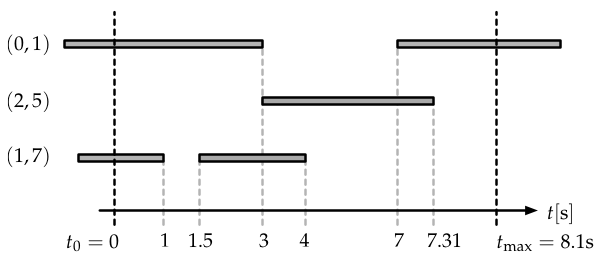

.. _temp_network_classes:

Temporal network classes
========================

Undirected and unweighted temporal networks are composed of :math:`N` nodes
and up to :math:`m_{\mathrm{max}}=N(N-1)/2` edges, where each edge :math:`(i,j)` can be
described as a series of events where the edge is either switched on 
or switched off. One way of expressing that is to define the temporal
adjacency matrix

.. math::
    A_{ij}(t) = \begin{cases} 1, & (i,j)\ \mathrm{connected\ at\ time\ } t\\
                              0, & \mathrm{else}.
                \end{cases}

In `tacoma`, we will interpret temporal networks as if they were recorded in an experiment.
We expect that over the course of time :math:`t_0\leq t < t_\mathrm{max}` in which we
recorded activity, we encountered :math:`N` nodes from the node set 
:math:`V=\{0,1,\dots,N-1\}` (nodes posses an integer label). However, nodes do not need
to be active (i.e. connected to other nodes) during the time of the experiment to be considered
in the node set.

    A temporal network and how it was recorded in an experiment. We additionally 
    assume to know that the network consists of :math:`N=8` nodes.
    Edges existed before
    we started measuring. An edge is considered to be "on" when it exists, shown as
    a grey bar in this figure. Each time an edge is switched "on" or switched "off",
    respectively, the network structure changes and hence this event is recorded. Here,
    the experiment ends before the edge :math:`(0,1)` is switched off.

The experiment begins at time :math:`t_0`, where the network consists of an 
edge set :math:`E_0 \subseteq \{i,j: V\times V, i<j\}`. Then, each time the network
changes, we denote that time by an entry in a time vector :math:`t`. Each entry
in the time vector corresponds to a network change event and thus to a change in the edge set.
We call the total number of change events :math:`N_e`, such that the vector :math:`t` has
:math:`N_e` entries.
In between consecutive 
times, the network is constant. After the last recorded event, we kept the experiment running
until the maximum time :math:`t_\mathrm{max}` without observing any change and stopped recording
at :math:`t_\mathrm{max}`.

There's three data structures implemented in this package, all of which capture the situation
described above in different ways and are useful in different situations.

.. _el_explanation:

Edge lists
~~~~~~~~~~

The class :class:`_tacoma.edge_lists` consists of a collection of complete edge lists,
each time the network changes, a complete edge list of the network after the change is saved.
It has the following attributes.

- :math:`N` : The total number of nodes
- :math:`t` : A vector of length :math:`N_e+1`. The 0-th entry contains the time of the beginning of the
  experiment :math:`t_0`
- `edges` : A vector of length :math:`N_e+1` where each entry contains an edge list, describing the 
  network after the change which occured at the corresponding time in :math:`t`. 
  The 0-th entry contains the edge list of the beginning of the experiment at :math:`t_0`
- :math:`t_\mathrm{max}` : The time at which the experiment ended.
- `time_unit` : A string containing the unit of time used for the recording.
- `notes` : Additional notes concerning the experiment.
- `int_to_node` : A dictionary mapping the node integers
  to string descriptors. This map can be empty. The map is supposed to be one-to-one.

The network described in the figure above would be recorded as 

.. code:: python

    import tacoma as tc

    tn = tc.edge_lists()
    tn.N = 8
    tn.t = [ 0.0, 1.0, 1.5, 3.0, 4.0, 7.0, 7.31 ]
    tn.tmax = 8.1
    tn.edges = [
                   [ (0, 1), (1, 7) ],
                   [ (0, 1) ],
                   [ (0, 1), (1, 7) ],
                   [ (2, 5), (1, 7) ],
                   [ (2, 5) ],
                   [ (0, 1), (2, 5) ],
                   [ (0, 1) ]
               ]
    tn.time_unit = 's'
    tn.notes = 'This experiment was conducted as a test.'
    tn.int_to_node = {
                       0 : 'Alice',
                       1 : 'Bob',
                       2 : 'Clara',
                       3 : 'Darren',
                       4 : 'Elle',
                       5 : 'Felicitas',
                       6 : 'George',
                       7 : 'Harriett',
                     }

.. _ec_explanation:

Edge changes
~~~~~~~~~~~~

The class :class:`_tacoma.edge_changes` consists of a collection of both edges being created
and edges being deleted.
It has the following attributes.

- :math:`N` : The total number of nodes.
- :math:`t_0` : The time of the beginning of the experiment.
- :math:`t` : A vector of length :math:`N_e`, each time corresponding to a change in the network.
- :math:`t_\mathrm{max}` : The time at which the experiment ended.
- `edges_initial` : The edge list of the beginning of the experiment at :math:`t_0`.
- `edges_in` : A list containing :math:`N_e` entries. Each entry is a list of integer
  tuples, describing the edges being created during this event.
- `edges_out` : A list containing :math:`N_e` entries. Each entry is a list of integer
  tuples, describing the edges being switched off  during this event.
- `time_unit` : A string containing the unit of time used for the recording.
- `notes` : Additional notes concerning the experiment.
- `int_to_node` : A dictionary mapping the node integers
  to string descriptors. This map can be empty. The map is supposed to be one-to-one.

The network described in the figure above would be recorded as 

.. code:: python

    import tacoma as tc
    
    tn = tc.edge_changes()
    tn.N = 8
    tn.t0 = 0.0
    tn.t = [ 1.0, 1.5, 3.0, 4.0, 7.0, 7.31 ]
    tn.tmax = 8.1
    tn.edges_initial = [ (0, 1), (1, 7) ]
    tn.edges_in = [
                    [], 
                    [ (1, 7) ],
                    [ (2, 5) ], 
                    [], 
                    [ (0, 1) ],
                    []
                  ]
    tn.edges_out = [   
                    [ (1, 7) ], 
                    [], 
                    [ (0, 1) ], 
                    [ (1, 7) ], 
                    [], 
                    [ (2, 5) ]
                   ]
    tn.time_unit = 's'
    tn.notes = 'This experiment was conducted as a test.'
    tn.int_to_node = {
                        0 : 'Alice',
                        1 : 'Bob',
                        2 : 'Clara',
                        3 : 'Darren',
                        4 : 'Elle',
                        5 : 'Felicitas',
                        6 : 'George',
                        7 : 'Harriett',
                     }

Edge trajectories
~~~~~~~~~~~~~~~~~

The class :class:`_tacoma.edge_trajectories` consists of a collection of 
:class:`_tacoma.edge_trajectory_enry`, one for each edge in the network
which was active at least once during the experiment. 
Each of those entries has attribute ``.edge`` containing the edge it is attributed to.
The second attribute of each
entry, ``.time_pairs`` is a list of pairs of doubles, each pair representing
a time interval in which the edge was active.

It has the following attributes.

- :math:`N` : The total number of nodes.
- :math:`t_0` : The time of the beginning of the experiment.
- :math:`t_\mathrm{max}` : The time at which the experiment ended.
- `trajectories` : A list of :class:`_tacoma.edge_trajectory_enry`, as described above.
- `time_unit` : A string containing the unit of time used for the recording.
- `notes` : Additional notes concerning the experiment.
- `int_to_node` : A dictionary mapping the node integers
  to string descriptors. This map can be empty. The map is supposed to be one-to-one.
- `edge_similarities` (Optional) : A dictionary of Tuple[Int, Int] -> double containing
  the similarities of two edges. The integers in the pairs correspond to the index of the edges
  in `trajectories`. This dictionary is computed when :class:`_tacoma.edge_trajectories`
  is generated from a conversion using :func:`tacoma.api.get_edge_trajectories` 
  with ``return_edge_similarity = True``.

The network described in the figure above would be recorded as 

.. code:: python

    import tacoma as tc

    traj = tc.edge_trajectories()
    entry = tc.edge_trajectory_entry

    traj.N = 8
    traj.t0 = 0.0
    traj.tmax = 8.1
    traj.trajectories = [
                            entry( (0,1), [(0., 3.), (7.0, 8.1)] ),
                            entry( (2,5), [(3., 7.31)] ),
                            entry( (1,7), [(0., 1.), (1.5, 4.0)] ),
                        ]
    traj.time_unit = 's'
    traj.notes = 'This experiment was conducted as a test.'
    traj.int_to_node = {
                         0 : 'Alice',
                         1 : 'Bob',
                         2 : 'Clara',
                         3 : 'Darren',
                         4 : 'Elle',
                         5 : 'Felicitas',
                         6 : 'George',
                         7 : 'Harriett',
                       }

Which class to use
~~~~~~~~~~~~~~~~~~

Each of the classes above has its specific use cases. Since most algorithms rely on
the actual order of network-changing events, the main classes in tacoma are 
:class:`_tacoma.edge_lists` and :class:`_tacoma.edge_changes`, meaning that 
almost all of the algorithms in this package are specifically implemented for both,
but not for :class:`_tacoma.edge_trajectories`.

:class:`_tacoma.edge_lists` is to prefer if you just want to sample an edge list at
a specific time. For :class:`_tacoma.edge_changes`, you would have to start at the
beginning of the network, then fast forward to that time to obtain an edge list. Edge 
lists are often easier to deal with, however, if the inter-event times are rather small
and the network is not sparse, two consecutive edge lists might be overlapping strongly.
Hence, edge changes are often faster to deal with and need less memory. Furthermore,
Algorithms which explicitly rely on edge changes, as e.g. dynamic Gillespie algorithms
are natively faster on :class:`_tacoma.edge_changes`.

:class:`_tacoma.edge_trajectories` is preffered for drawing an 
:func:`tacoma.drawing.edge_activity_plot` or to estimate edge-activity rates.
