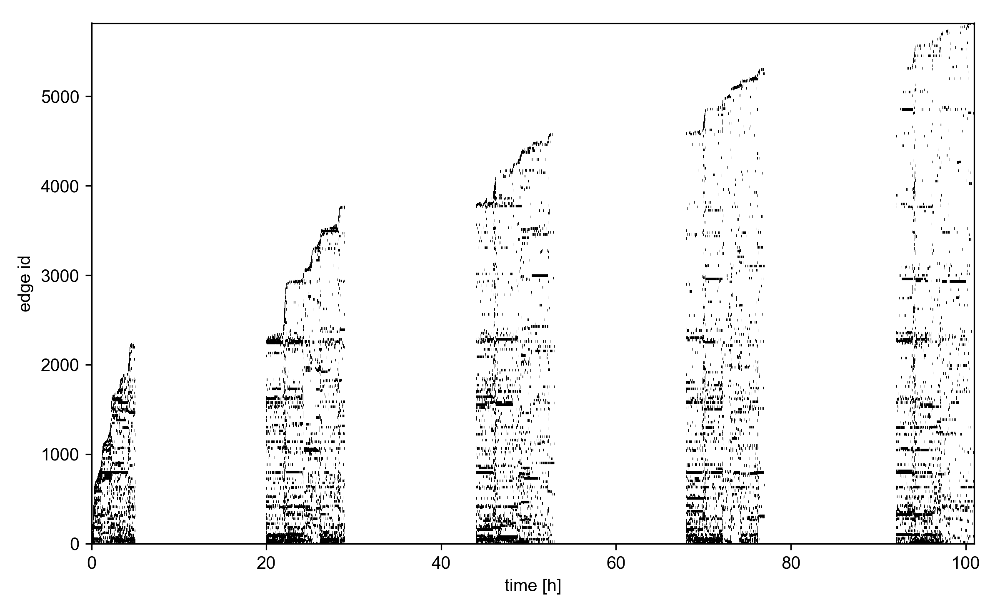

Drawing
=======

Edge activity plots
-------------------

The visualization of temporal networks is an area of active research.
`tacoma`'s contribution is a so-called `edge activity plot`, where
edges are attributed to an integer id, sorted for their order of
appearance. Then, each edge is drawn as a bar for the duration of 
its existence (active time periods, respectively). 
This is closely related to the representation of
a temporal network as a list of active intervals, 
:class:`_tacoma.edge_trajectories`. The function to draw 
edge activity plots is :func:`_tacoma.edge_activity_plot`.

Here's some example code

.. code:: python

    import os
    import tacoma as tc

    from tacoma.drawing import edge_activity_plot
    import matplotlib.pyplot as pl

    if not os.path.exists('~/.tacoma/hs13.taco'):
        hs13 = tc.download_and_convert_sociopatterns_high_school_2013()
    else:
        hs13 = tc.load_sociopatterns_high_school_2013()

    edge_activity_plot(hs13,
                       time_normalization_factor = 1/3600.,
                       time_unit='h',
                       alpha = 1.0,  # opacity
                       linewidth = 1.5,
                       )
    
    pl.show()

    Edge activity in the temporal network Sociopatterns high school 2013.

An edge activity plot is useful since it conveys a lot of information in 
the data visually. Occurences of longer horizontal bars show that there's likely
broad contact duration distribution. Vertical bars show that there's increased
activity during a certain period of time over the whole network.
Edges from groups tend to be observed for the first time at the same time
so naturally clusters are observed as recurring broad bars.
